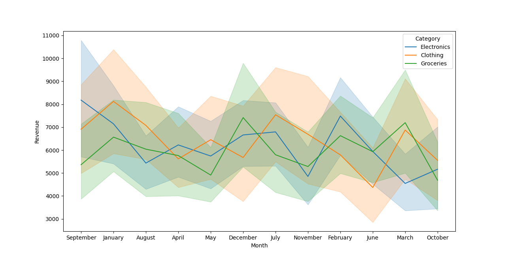
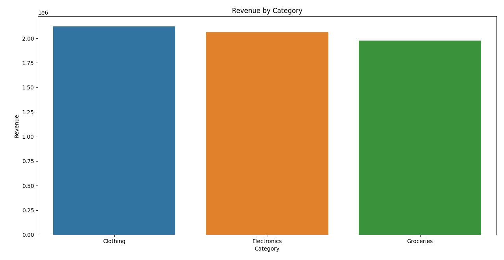

# 📈 Sales Trend Visualization

## Objective
Analyze sales data to identify trends and business insights.

## 🛠️ Tools & Technologies
- Python
- Pandas
- NumPy
- Matplotlib
- Seaborn
- Jupyter Notebook
- GitHub

## 📊 Analysis Performed

✔ Data Cleaning

✔ Missing Value Handling

✔ Exploratory Data Analysis (EDA)

✔ Monthly Sales Trend Analysis

✔ Category-wise Revenue Analysis

✔ Region-wise Sales Performance

✔ Top Selling Products Analysis

✔ Profitability Analysis

## 📈 Visualizations

The project includes:

- Monthly Sales Trend Line Chart
- Category-wise Revenue Bar Chart
- Region-wise Sales Pie Chart
- Top Products Analysis
- Profit Distribution Charts

### Monthly Sales Trend



### Category-wise Sales



## Dashboard
(Add dashboard screenshot)

## 💡 Key Insights

- Electronics generated the highest revenue.
- The West region recorded the strongest sales performance.
- Sales showed significant growth during the final quarter.
- A small group of products contributed a large portion of total revenue.
- Certain categories produced higher profit margins than others.

## 📁 Project Structure

sales-trend-visualization/
│
├── data/
├── notebooks/
├── screenshots/
├── README.md
└── requirements.txt

## ▶️ How to Run

1. Clone the repository
2. Install dependencies
3. Open the Jupyter Notebook
4. Run all cells

```bash
pip install -r requirements.txt
jupyter notebook 
```

---

# 👨‍💻 Author

```markdown
# Somesh Kailase
